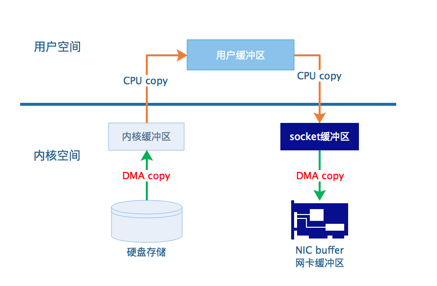
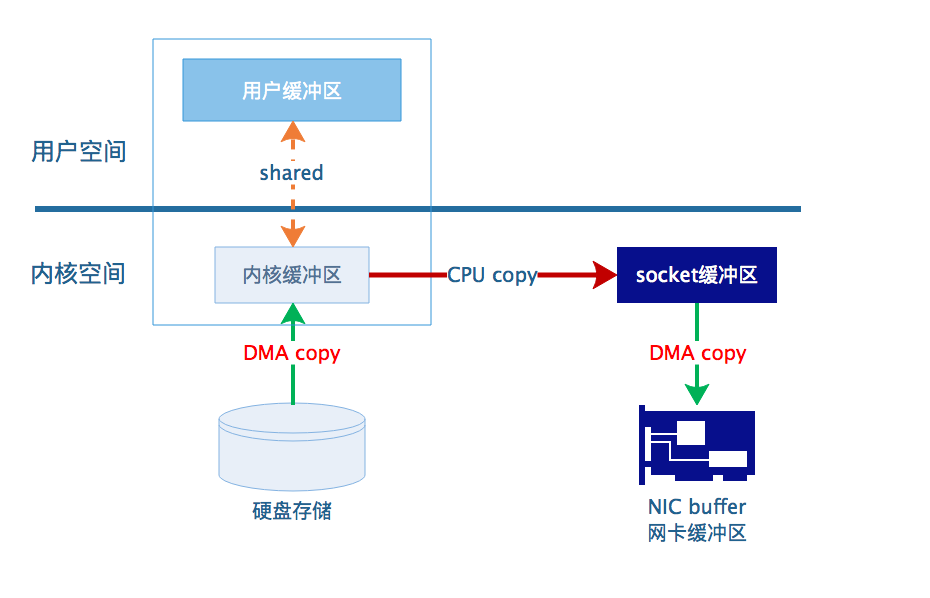
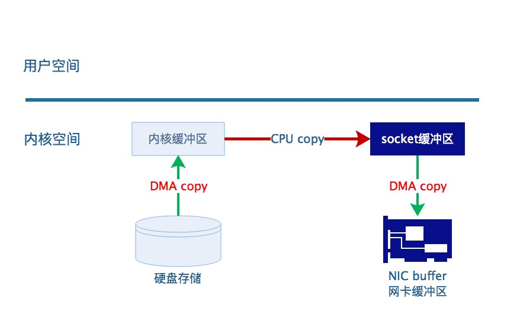

## ZERO-COPY诞生的目的

### 基础知识
1. linux/unix下的哲学核心思想是‘一切皆文件’。
[一切皆文件](https://scoolor.github.io/2018/11/08/linux-everything-is-file/)

2. DMA(Direct Memory Access，直接存储器访问) 是所有现代电脑的重要特色，它允许不同速度的硬件装置来沟通，而不需要依赖于 CPU 的大量中断负载。否则，CPU 需要从来源把每一片段的资料复制到暂存器，然后把它们再次写回到新的地方。在这个时间中，CPU 对于其他的工作来说就无法使用。
[什么是DMA](https://baike.baidu.com/item/DMA/2385376)
### linux层面的Zero-Copy
1. IO调用


2. 使用mmap达成的ZERO-COPY IO调用(对应FileChannel中的map())


3. 使用sendFile达成的ZERO-COPY(对应FileChannel中的transferTo/From())


### java层面的Zero-Copy
#### 文件操作的Zero-Copy
```java
MapperByteBuffer buff = FileChannel.map(); //对应系统级别的mmap
FileChannel.transferTo(); //对应系统级别的sendFile
```
#### 网络IO的Zero-Copy
网络IO中没有对应系统级别Zero-Copy.
只有在java语言层面进行优化实现的Zero-Copy.
1. 比如说使用DirectoryBuffer代替HeapBuffer.
2. 还有netty对ByteBuffer的优化包装类ByteBuf,池化ByteBuf,实现资源的共享和再利用.

ByteBuff buff = Directory.allocat();
利用堆外内存(进程的虚拟内存),减少IO操作的copy

> 参考及引用

[深入剖析Linux IO原理和几种零拷贝机制的实现](https://juejin.im/post/6844903949359644680)
[Netty对零拷贝(Zero Copy)三个层次的实现](https://zhuanlan.zhihu.com/p/88599349)
[Java NIO direct buffer的优势在哪儿？](https://www.zhihu.com/question/60892134)
