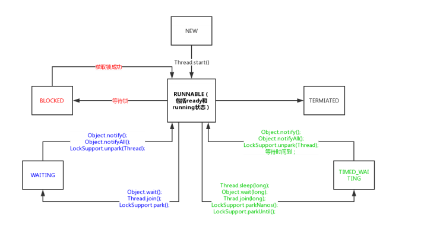

## 生命周期



| 状态       | 含义           | 转变方法                                  |
| ---------- | -------------- | ----------------------------------------- |
| new        | Thread对象创建 | start()->转变为runnable状态(线程创建)     |
| runnable   | 可运行状态     | cpu时间片调度->转变为running; 意外终止    |
| running    | 运行中         | stop()或逻辑标识->terminated              |
|            |                | sleep();wait()加入waitSet;->blocked       |
|            |                | 阻塞IO操作,例如网络IO->bolcked            |
|            |                | 获取锁资源,加入该锁的阻塞队列->blocked    |
|            |                | cpu调度使线程放弃执行->runnable           |
|            |                | yiled();放弃cpu执行权力->runnable         |
|            | 阻塞中         | stop();意外死亡(JVM crash)->terminated    |
|            |                | 阻塞结束;sleep结束;->runnable             |
|            |                | 其他线程的notify();notifyAll();->runnable |
|            |                | 获取到了锁;->runnable                     |
|            |                | 阻塞被打断;interrupt->runnable            |
| terminated | 终结           | 正常结束;运行出错结束;->terminated        |
|            |                | JVM Crash 导致所有进程结束                |

## Thread的构造函数

``` java
public synchronized void start() {
    /**
     * This method is not invoked for the main method thread or "system"
     * group threads created/set up by the VM. Any new functionality added
     * to this method in the future may have to also be added to the VM.
     *
     * A zero status value corresponds to state "NEW".
     */
    //status is "NEW"?
    if (threadStatus != 0)
        throw new IllegalThreadStateException();

    /* Notify the group that this thread is about to be started
     * so that it can be added to the group's list of threads
     * and the group's unstarted count can be decremented. */
    group.add(this);

    boolean started = false;
    try {
        //jndi方法,在其中调用了线程的run()
        start0();
        //synchronized保证状态安全
        started = true;
    } finally {
        try {
            if (!started) {
                group.threadStartFailed(this);
            }
        } catch (Throwable ignore) {
            /* do nothing. If start0 threw a Throwable then
              it will be passed up the call stack */
        }
    }
}
```


```java
private void init(ThreadGroup g, Runnable target, String name,
                  long stackSize, AccessControlContext acc,
                  boolean inheritThreadLocals) {
    if (name == null) {
        throw new NullPointerException("name cannot be null");
    }

    this.name = name;

	//父线程为创建该线程的线程
    Thread parent = currentThread();
    SecurityManager security = System.getSecurityManager();
    if (g == null) {
        /* Determine if it's an applet or not */

        /* If there is a security manager, ask the security manager
           what to do. */
        if (security != null) {
            //如果有安全管理器方案,那么按照安全管理器的方案进行初始化父线程组
            g = security.getThreadGroup();
        }

        /* If the security doesn't have a strong opinion of the matter
           use the parent thread group. */
        if (g == null) {
            //默认加入父线程的线程组
            g = parent.getThreadGroup();
        }
    }

    /* checkAccess regardless of whether or not threadgroup is
       explicitly passed in. */
    g.checkAccess();

    /*
     * Do we have the required permissions?
     */
    if (security != null) {
        if (isCCLOverridden(getClass())) {
            security.checkPermission(SUBCLASS_IMPLEMENTATION_PERMISSION);
        }
    }
```


* 什么是守护线程

* 为什么要有守护线程

* 什么时候需要守护线程

  ※The Java Virtual Machine exits when the only threads running are all daemon threads.

1. 守护线程的属性deamon is true
2. 守护线程是具有**父子传递性**的
3. 守护线程的特性是它的生命周期是会自动结束的,在没有非守护线程存活时,它会自动terminated
4. 守护线程通常作为后台线程存在,例如游戏和服务器通信的线程

## Thread的API

### sleep()

1. sleep方法会使当前线程进入指定毫秒数的休眠，暂停执行(blocked)
2. 虽然给定了一个休眠的时间，但是最终要以系统的定时器和调度器的精度为准
3. 休眠有一个非常重要的特性，那就是其不会放弃monitor锁的所有权
4. 只会让当前线程进入休眠
5. 建议使用TimUtil替代Thread.sleep();

### yield()和priority()

* 都是不可靠方法,即无法保证属性在所有情况下都一定会生效
* yield()目标是告知CPU当前线程会放弃执行机会
* 优先级高的线程"可能"会获得更多的CPU执行机会

### getId()

* 获取指定线程的线程ID

### currentThread()

* 获取当前线程

### setContextClassLoader()

* 设置当前线程的类加载器

### interrput()

* Object 的 wait 方法; wait(long); wait(long, int)方法。

* Thread 的 sleep(long)方法。 Thread 的 sleep（ long， int）方法。
* Thread 的 join 方法。 Thread 的 join（ long）方法。 Thread 的 join（ long， int）方法。
* InterruptibleChannel 的 io 操作。
* Selector 的 wakeup 方法。
* 其他方法

上述方法都会将线程进入blocked状态

调用interrupt(),会将线程状态从blocked状态重置为runnable

### join()

```java
public final synchronized void join(long millis)
throws InterruptedException {
    long base = System.currentTimeMillis();
    long now = 0;

    if (millis < 0) {
        throw new IllegalArgumentException("timeout value is negative");
    }

    if (millis == 0) {
        //当前线程dead终止循环
        while (isAlive()) {
            //wait()方法-> 锁主体(被竞争的对象): this,竞争线程: Thread.currentThread()
            wait(0);
        }
    } else {
        while (isAlive()) {
            long delay = millis - now;
            if (delay <= 0) {
                break;
            }
            wait(delay);
            now = System.currentTimeMillis() - base;
        }
    }
}
```

### 如何关闭一个线程

##### 正常关闭

1. 线程生命周期正常结束,如代码执行完毕

2. 捕获中断信号退出

   ```java
   while (!isInterrupted()) {
   	//working.
   }
   //代码的风险在于isInterrupted方法的标记可能被擦除,线程无法按照预设逻辑退出

   while(true){
   //working.
   	try {
   		TimeUnit. MILLISECONDS. sleep( 1);
   	} catch (InterruptedException e){
           break;
       }
   }
   //代码的风险在于不是每段代码都会有InterruptedException方法调用
   ```

3. 使用volatile开发控制

   ```java
   private volatile boolean closed = false;
   run(){
       while (!closed && !isInterrupted()) {
           //正在 运行
       }
       System. out. println(" I will be exiting.");
   }

   close(){
       this. closed = true;
       this. interrupt();
   }
   ```

##### 异常关闭

在一个线程的执行单元中，是不允许抛出checked异常的，不论Thread中的run方法，还是Runnable中的run方法，如果线程在运行过程中需要捕获checked异常并且判断是否还有运行下去的必要，那么此时可以将checked异常封装成unchecked异常（RuntimeException）抛出进而结束线程的生命周期。

##### 进程假死

相信很多程序员都会遇到进程假死的情况，所谓假死就是进程虽然存在，但没有日志输出，程序不进行任何的作业，看起来就像死了一样，但事实上它是没有死的，程序之所以出现这样的情况，绝大部分的原因就是某个线程阻塞了，或者线程出现了死锁的情况。

这种情况需要借助工具,比如jstack,jconsole,jvisualvm

## 线程安全与数据同步

### 并发的两个关键问题

线程间如何通信？即：线程之间以何种机制来交换信息

线程间如何同步？即：线程以何种机制来控制不同线程间操作发生的相对顺序

有两种并发模型可以解决这两个问题：

- 消息传递并发模型

- 共享内存并发模型  (**java使用**)

- 对于每一个线程来说，栈都是私有的，而堆是共有的。

  也就是说在栈中的变量（局部变量、方法定义参数、异常处理器参数）不会在线程之间共享，也就不会有内存可见性的问题，也不受内存模型的影响。而在堆中的变量是共享的，本文称为共享变量。

  所以，内存可见性是针对的**共享变量**。

* 既然堆是共享的，为什么在堆中会有内存不可见问题?

  这是因为现代计算机为了⾼效，往往会在⾼速缓存区中缓存共享变量，因为cpu访问缓存区⽐访问内存要快得多。

  JMM又规定:

  1. 所有的共享变量都存在主内存中。

  2. 每个线程都保存了⼀份该线程使⽤到的共享变量的副本。

  3. 如果线程A与线程B之间要通信的话，必须经历下⾯2个步骤：

      i.  线程A将本地内存A中更新过的共享变量刷新到主内存中去。

      ii.  线程B到主内存中去读取线程A之前已经更新过的共享变量。

  **所以，线程A⽆法直接访问线程B的⼯作内存，线程间通信必须经过主内存。**


## 线程间通信

## ThreadGroup

## Hook线程以及捕获线程执行异常

## 线程池原理及自定义线程池
