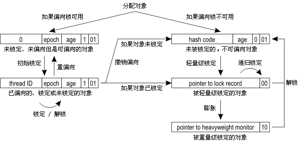

## 为什么会有锁升级
* **synchronize面临的问题:** java线程是映射到OS层面的内核线程上实现的,那么对线程的阻塞和唤醒必然要切换到Ring0态,而从用户态到内核态所花费的时间CPU时间甚至可能比线程本身执行时间还要长.而synchronize不可避免的会将抢锁失败的线程挂起进入BLOCKED状态.

* **分析可优化的点:**
  1. 让线程不阻塞(偏向锁)
  2. 让线程不切换到Ring0态(自旋锁)

### 锁升级的方式和原理
[参考文章](https://github.com/farmerjohngit/myblog/issues/12)

