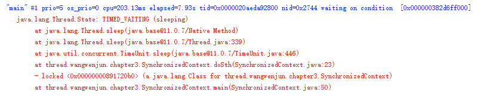
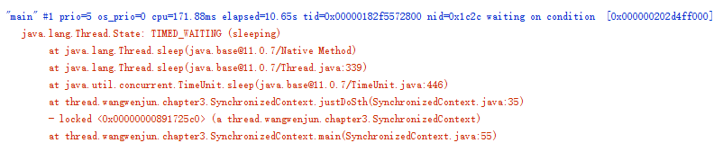
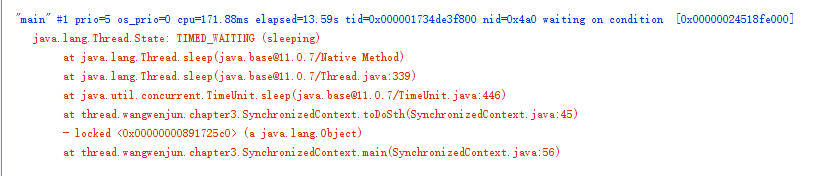

### synchronize如何加锁
### 1. 在static方法上加上synchronize关键字
锁住的对象: Object.class

### 2. 在实例方法上加上synchronize关键字
锁住的对象: this

### 3. 代码块加上synchronize关键字
锁住的对象: target object


``` java
public class SynchronizedContext {
    private final Object lockObject = new Object();

    private void sleep() {
        try {
            TimeUnit.SECONDS.sleep(30);
        } catch (InterruptedException e) {
            e.printStackTrace();
        }
    }

    private static synchronized void doSth() {
        try {
            System.out.println("static");
            Thread thread = new Thread();
            thread.start();
            //blocking-io operate--blocked
            TimeUnit.SECONDS.sleep(30);
        } catch (InterruptedException e) {
            e.printStackTrace();
        }
    }

    private synchronized void justDoSth() {
        try {
            System.out.println("synchronized method");
            TimeUnit.SECONDS.sleep(30);
        } catch (InterruptedException e) {
            e.printStackTrace();
        }
    }

    private void toDoSth() {
        try {
            synchronized (lockObject) {
                System.out.println("synchronized area");
                TimeUnit.SECONDS.sleep(30);
            }
        } catch (InterruptedException e) {
            e.printStackTrace();
        }
    }

    public static void main(String[] args) {
//        doSth();
        SynchronizedContext syncObject = new SynchronizedContext();
//        syncObject.justDoSth();
        syncObject.toDoSth();
    }
}
```
