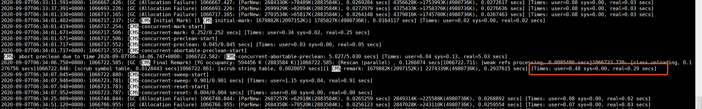
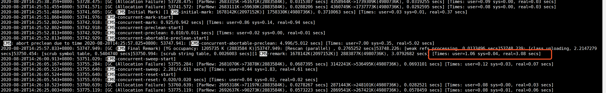

### 分析
根据图2可以看出每次在Concurrent Abortable Preclean阶段，系统是等到默认的最大时间5s之后才退出此阶段的.可以看出preclean阶段的效果并不是很好
并且明显可以看到,在图1中的YG占用小的时候,major GC进行的速度是快很多的.

因为中断预处理过程中一直都没能等到一次 Minor gc，新生代还有很多活着的对象，这也给remark阶段增加了很多的扫描工作量，所以建议增加CMSScavengeBeforeRemark 。

-XX:+CMSScavengeBeforeRemark
因为CMS在remark是扫描整个堆空间,所以在CMS remark前启动一次 Minor gc，目的在于回收掉大部分的对象，减少gc remark阶段扫描的开销。

### 结论
1）增加-XX:+CMSScavengeBeforeRemark后的确达到了一定效果，消灭了一半的较长的停顿

2）关于class unloading的问题，跟踪了一下，总体的unload的class数并没有很大，属于正常范围。

主要unload的类大都为：class sun.reflect.GeneratedMethodAccessor和GeneratedConstructorAccessor。
造成的原因是RPC在Method.invoke时使用了反射，CMS在GC尝试回收没有用的反射类。这部分可暂时不调整（变动成本太大，得到的性能提升不对等）。

综合以上，建议增加-XX:+CMSScavengeBeforeRemark 参数即可。

### 切换G1
https://www.jianshu.com/p/db2cd9ad699a
https://tech.meituan.com/2016/09/23/g1.html

####切换到G1的动机
总之，CMS垃圾回收器不能满足我们对性能的需求，而G1相比CMS有更清晰的优势：

CMS没有采用复制算法，所以它不能压缩，最终导致内存碎片化问题。而G1采用了复制算法，它通过把对象从若干个Region拷贝到新的Region过程中，执行了压缩处理。
在G1中，堆是由Region组成的，因此碎片化问题比CMS肯定要少的多。而且，当碎片化出现的时候，它只影响特定的Region，而不是影响整个堆中的老年代。
而且CMS必须扫描整个堆来确认存活对象，所以，长时间停顿是非常常见的。而G1的停顿时间取决于收集的Region集合数量，而不是整个堆的大小，所以相比起CMS，长时间停顿要少很多，可控很多。

#### 调优
G1偶然性出现奇怪的soft/weak引用清理，从下面的日志可以看出，在YGC阶段清理时，Ref Proc居然耗时达到101.3毫秒，从而导致Eden区减少，这就会导致部分对象提早晋升到Old区，从而导致并发GC周期变短：
```
2015-06-10T12:00:01.854+0000: 711685.290: [GC pause (G1 Evacuation Pause) (young) [Ref Proc: 4.0 ms] [Eden: 2904.0M(2904.0M)->0.0B(2872.0M)
2015-06-10T12:00:05.899+0000: 711689.335: [GC pause (G1 Evacuation Pause) (young) [Ref Proc: 101.3 ms] [Eden: 2872.0M(2872.0M)->0.0B(216.0M) Survivors: 32.0M->40.0M Heap: 4570.1M(5120.0M)->1706.8M(5120.0M)]
```

我们通过设置-XX:G1NewSizePercent=40，即设置年轻代占用堆最小百分比为40%来解决这个问题。因为有了这个设置，即使引用处理耗时变长，Eden区大小也不可能比这个阈值更低，从而避免对象提早晋升。同时，我们还添加了参数-XX:+ParallelRefProcEnabled，从而在Remark阶段多线程并发处理引用对象.
